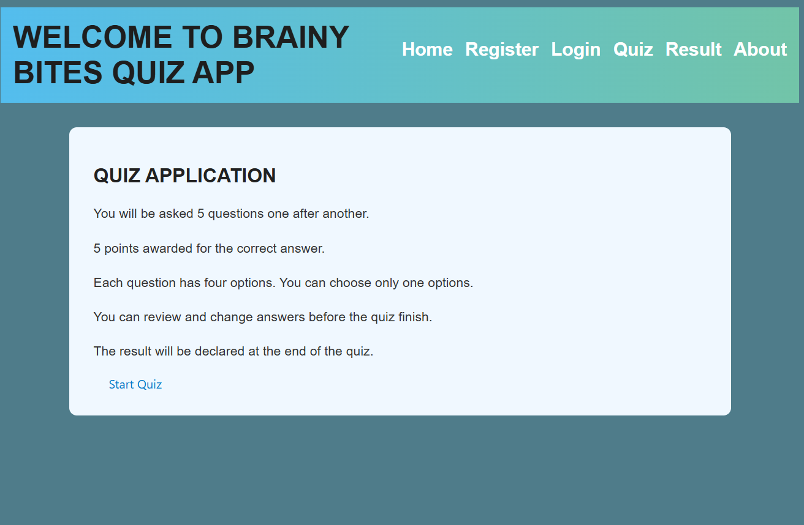

This is a full-stack MERN (MongoDB, Express, React, Node.js) quiz application that allows users to create, take, and manage quizzes.
/**visual pages**/
 C:\Users\rajku\OneDrive\Desktop\325_9_Kavitha_Capstone_Project\project_screenshots

/**Features**/
* Working with complex MongoDB, queries, schemas, models.
* User registration form and form validation
* Allows registered users to login
* Take quizzes with multiple-choice questions.
* Real-time scoring and immediate feedback on quiz results.
/**Installation**/
Clone the repository:

git clone https://github.com/Kavithachinnusamy20/Capstone_Brainy_Bites
/**client/frontend**/                                
# Create a new Vite project
npm create vite@latest

# Provide project details when prompted:
# - Project name: client
# - Framework: React
# - Variant: JavaScript

# Navigate into the project folder
cd client

# Install dependencies
npm install

# Start the development server
npm run dev

# To add React Router DOM 
npm install react-router-dom

# To install Axios
npm install axios

/**server/backend**/ 
 # Create package.json
npm init -y 

# Main server file       # Web framework            
touch index.js

# create node-modules and package-lock-json
npm i express

# MongoDB ODM  
npm i mongoose 

# Middleware for Cross-Origin access   
npm i cors  

# Load environment variables      
npm i dotenv 

 # Password encryption     
npm i bcrypt  

MONGO_URL=your_connection_string_here
PORT=8080
Create .env file 
# Line 10 in .gitignore
.env
# If needed, clean & reinstall
rm -rf node_modules package-lock.json npm install

/**Project structure**/
Capstone Project── Components/

/**Client**/
├── Components/
 |   └── home.jsx            # Landing page
│   ├── Navbar.jsx           # Navigation bar -React Router for routings
│   ├── Register.jsx         # User registration page
│   ├── Login.jsx            # Login page for authentication
│   ├── Quiz.jsx             # Quiz question display and interaction
|   ├── Questions.jsx        # question display format
│   ├── Result.jsx           # Display of user score after quiz
│   ├── Error.jsx            # Fallback for route or server errors
│   |__QuestionsAdmin.jsx
│
├── hooks/
│   └── useForm.js           # Custom hook for Registerform handling and validation
│── utils/
│   └── validate.js          # validation for Registerform
├── styles/
│   ├── register.css         # Styles for the registration form
│   ├── Navbar.css           # Styles for the navigation bar
│   └── quizbutton.css       # Button styling for quiz interactions
├──App.css                   # styling about page
├── App.jsx                  # Entry all routes and components and Fetch for making API requests
└── main.js                  # Main React DOM rendering

/**Server**/
├── controllers/
│   ├── authControllers.js   # #bcrypt for database operations for secure password 
|    |                          handling   Login a registration logic
│   └── controllers.js       # 1. getQuestions(req, res) fetch a random 5 questions from DB
- 

├── models/
│   ├── questions.js         # MongoDB schema for quiz questions
│   └── register.js          # MongoDB schema for user (register and login )info
│
├── QuizDataLoad/
│   ├── loadQuiz.js          #  loads quiz questions from quizData.js and 
                            inserts them into MongoDB and it check duplicate,
│   └── quizData.js          # Quiz data object (questions, options, answers)

┣___db.js                  #connection between your Node.js application and MongoDB 
                           using the connection string stored in the environment variable MONGO_URL.
┃ 
┃___index.js                #  Node.js application, handling API routes, authentication,
                             middleware, and environment configuration

      png)                     